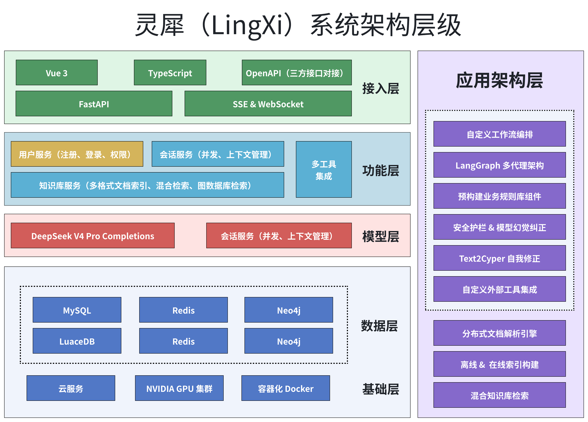

# 灵犀（LingXi）

> 基于 Multi-Agent 架构的企业级智能客服系统 —— 也是一个可快速二次开发的 AI Agent 应用脚手架。

[](https://www.python.org/)
[](https://fastapi.tiangolo.com/)
[](https://langchain-ai.github.io/langgraph/)
[](LICENSE)

---

## 项目简介

**灵犀**是一个面向企业级场景的 AI Agent 应用，以电商智能客服为落地示例，完整实现了从意图识别、混合检索（GraphRAG + Neo4j）、任务分解到多工具并行的全链路 Agent 架构。

项目核心定位有二：

| 定位 | 说明 |
|------|------|
| **AI Agent 脚手架** | 高度模块化、配置驱动的架构设计，可快速替换业务组件、适配新场景 |
| **多模型演进平台** | 当前已支持 DeepSeek / Ollama 双通道，后续将扩展多模型动态选择能力 |

---

## 架构总览

### 系统架构



从架构上看，**灵犀**底层通过深度的工程化集成，将异构技术栈整合为一套标准化、高复用、易扩展的综合性应用系统，致力于打造企业级快速开发的基础底座。

| 层级 | 技术栈 |
|------|--------|
| **模型集成** | DeepSeek V4 API + Ollama 私有化部署（支持任意 Ollama 模型） |
| **Agent 框架** | LangGraph Multi-Agent + LangChain 组件化 |
| **混合检索** | Neo4j Text2Cypher + Microsoft GraphRAG |
| **数据存储** | MySQL（业务数据）+ Neo4j（知识图谱） |
| **前端** | Vue 3 + Element Plus |
| **部署** | FastAPI + Uvicorn（支持多 Worker） |

---

## 核心功能

### Agent 全链路

| 模块 | 功能 | 技术实现 |
|------|------|----------|
| **意图识别** | 自动分类用户问题类型 | LangGraph Router + 结构化输出 |
| **安全护栏** | 判断问题是否在业务范围内 | 提示工程 + Neo4j Schema 动态注入 |
| **任务分解** | 复杂问题拆分为独立子任务 | Planner 组件 + Few-shot Prompt |
| **工具选择** | 为每个子任务分配合适工具 | Tool Selection Chain |
| **Map-Reduce** | 多子任务并行执行、结果汇总 | LangGraph Send API |
| **幻觉检测** | 最终回复前的幻觉校验 | Hallucination Checker Node |

### 业务组件（可替换）

| 组件 | 说明 | 替换方式 |
|------|------|----------|
| `general-query` | 闲聊/一般性问题回复 | 修改提示词模板 |
| `additional-query` | 信息不足时追问引导 | 修改追问策略 |
| `graphrag-query` | 知识库混合检索（核心） | 替换子图实现 |
| `image-query` | 图片识别与回复 | 替换视觉模型 |
| `file-query` | 文件上传与索引 | 替换索引引擎 |

### 混合检索（GraphRAG + Neo4j）

- **Microsoft GraphRAG**：非结构化文档的知识图谱构建与检索
- **Neo4j Text2Cypher**：自然语言 → Cypher 查询语句的自动生成与执行
- **预构建 Cypher 字典**：高频查询模板 + Few-shot 引导，提升准确率
- **Cypher 校验与自修正**：语法校验、权限控制、关系方向校正、大模型辅助纠错

### 多模型支持

| 服务 | 当前支持 | 未来规划 |
|------|----------|----------|
| 对话服务 | DeepSeek V4 / Ollama 本地模型 | 用户可按需选择模型 |
| 推理服务 | DeepSeek R1 / Ollama 本地模型 | 动态路由到不同模型 |
| Agent 编排 | DeepSeek V4 / Ollama 本地模型 | 多模型混合编排 |
| 视觉模型 | DeepSeek Vision / 可配置 | 多视觉模型切换 |

> 正在规划：用户可在前端选择不同大模型，后端动态路由到对应的 LLM 服务，实现类似 ChatGPT 的多模型切换体验。

---

## 技术栈

| 层级 | 技术 | 说明 |
|------|------|------|
| **Web 框架** | FastAPI | 异步高性能 API 服务 |
| **Agent 框架** | LangGraph + LangChain | Multi-Agent 编排、工具集成、链式调用 |
| **图数据库** | Neo4j | 结构化知识存储与 Cypher 查询 |
| **知识图谱 RAG** | Microsoft GraphRAG | 非结构化文档的实体-关系图谱构建与检索 |
| **关系型数据库** | MySQL + SQLAlchemy | 用户、会话、消息记录持久化 |
| **大模型** | DeepSeek V4/R1 + Ollama | 云端 API + 本地私有化部署 |
| **前端** | Vue 3 + Element Plus | 交互式智能客服界面 |
| **认证** | JWT | 用户登录与 Token 鉴权 |

---

## 项目结构

```
lingxi_backend/
├── app/
│   ├── core/               # 核心配置、中间件、日志
│   │   ├── config.py       # 统一配置管理（.env → Pydantic Settings）
│   │   └── middleware.py   # 请求日志、CORS
│   ├── lg_agent/           # AI Agent 核心模块
│   │   ├── lg_builder.py   # Multi-Agent 图结构构建
│   │   ├── lg_prompts.py   # 全部提示词模板
│   │   ├── lg_states.py    # LangGraph 状态定义
│   │   ├── utils.py        # 工具函数
│   │   └── kg_sub_graph/   # 知识图谱子图
│   │       └── agentic_rag_agents/
│   │           └── components/cypher_tools/
│   │               ├── text2cypher.py      # 自然语言→Cypher
│   │               ├── predefined_cypher.py # 预构建 Cypher 字典
│   │               ├── cypher_validator.py  # Cypher 校验器
│   │               └── node.py             # 工具节点定义
│   ├── graphrag/           # Microsoft GraphRAG 集成
│   │   ├── settings.yaml   # GraphRAG 配置
│   │   └── data/           # 索引输入/输出
│   ├── services/           # 业务服务层
│   │   ├── indexing_service.py  # 文件索引服务
│   │   └── ...             # 其他服务
│   └── ...                 # 其他模块
├── docs/                   # 文档与 Notebook
├── images/                 # 架构图
├── main.py                 # FastAPI 入口
├── run.py                  # 启动脚本
├── requirements.txt        # 依赖清单
├── .env.example            # 配置模板
└── README.md               # 本文件
```

---

## 快速开始

### 1. 环境要求

- Python 3.11+
- MySQL 8.0+
- Neo4j 5.x（需安装 APOC 插件）
- Ollama（可选，用于本地模型）

### 2. 安装

```bash
# 克隆项目（后端）
git clone git@github.com:Shichuan-Hao/lingxi_backend.git
cd lingxi_backend

# 前端仓库（Vue 3）
# git clone git@github.com:Shichuan-Hao/lingxi_web.git

# 创建虚拟环境
conda create -n lingxi python=3.11 -y
conda activate lingxi

# 安装依赖
pip install -r requirements.txt
```

### 3. 配置

```bash
# 复制配置模板
cp .env.example .env

# 编辑 .env，填写必要配置：
#   DEEPSEEK_API_KEY  - DeepSeek API 密钥
#   DB_HOST / DB_USER / DB_PASSWORD  - MySQL 连接信息
#   NEO4J_URL / NEO4J_USERNAME / NEO4J_PASSWORD  - Neo4j 连接信息
#   SECRET_KEY  - JWT 签名密钥（生产环境务必更换）
```

### 4. 启动

```bash
# 开发模式（热重载）
python run.py

# 生产模式（单 Worker）
python run.py --prod

# 生产模式（多 Worker）
python run.py --prod -w 4
```

访问：
- 前端界面：`http://localhost:8000`
- API 文档：`http://localhost:8000/docs`

---

## 核心设计模式

### 1. 配置驱动的模型切换

```python
# .env
CHAT_SERVICE=deepseek    # 或 ollama
AGENT_SERVICE=deepseek   # 或 ollama

# 代码中自动路由
if settings.AGENT_SERVICE == ServiceType.DEEPSEEK:
    model = ChatDeepSeek(...)
else:
    model = ChatOllama(...)
```

### 2. 子图可替换架构

每个业务节点是独立的子图，替换时只需：
1. 实现新的节点/子图逻辑
2. 在 `route_query()` 中注册路由
3. 更新提示词中的分类描述

### 3. Map-Reduce 并行工具调用

```python
# LangGraph Send API 实现动态并行分发
return Command(
    goto=[Send("tool_a", {...}), Send("tool_b", {...})]
)
```

---

## 面试亮点

如果将此项目用于秋招面试，以下技术点值得重点准备：

1. **Multi-Agent 架构设计**：为什么用 LangGraph 而不是 LangChain 的 AgentExecutor？图结构的优势在哪？
2. **意图识别 + 结构化输出**：如何保证分类准确性？提示工程的设计思路？
3. **混合检索策略**：GraphRAG 和 Text2Cypher 各自适用什么场景？如何做结果融合？
4. **Cypher 校验闭环**：从生成 → 校验 → 修正 → 执行的完整流程
5. **安全护栏**：如何防止越权查询？Schema 动态注入的作用
6. **性能优化**：Map-Reduce 并行 vs 串行、预构建 Cypher 字典的缓存策略

---

## 演进路线

| 阶段 | 目标 | 状态 |
|------|------|------|
| Phase 1 | 电商智能客服 MVP | ✅ 已完成 |
| Phase 2 | 通用 AI Agent 脚手架 | ✅ 已完成 |
| Phase 3 | 多模型动态选择（用户可切换） | 📋 规划中 |
| Phase 4 | 多租户 + 插件市场 | 💡 远期规划 |

---

## License

MIT
